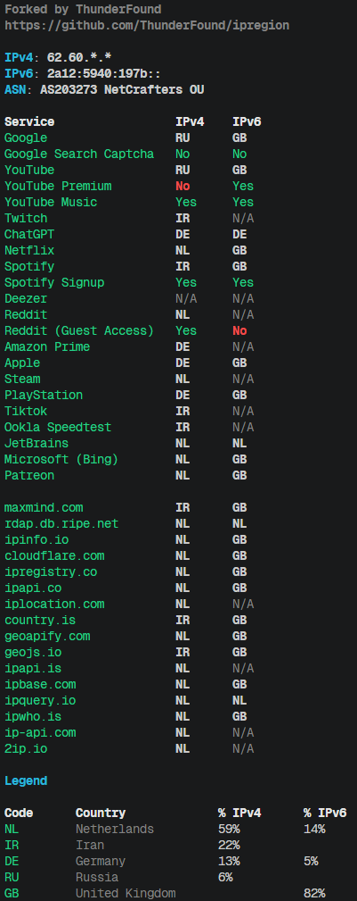
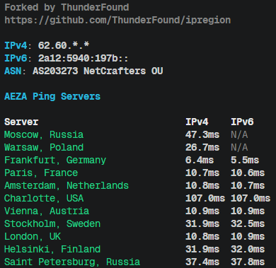

# ipregion

A bash script for determining your IP geolocation using various GeoIP services and popular websites.  
This is a fork of a [fork](https://github.com/Davoyan/ipregion) of the [original script](https://github.com/vernette/ipregion/), with some impovements like parallelization.

## Usage
Run script directly from GitHub:
```bash
bash <(wget -qO- https://raw.githubusercontent.com/ThunderFound/ipregion/refs/heads/main/ipregion.sh)
```

Output example:

<p>
  
  
</p>

## What's New in This Fork

This fork of the fork has a few features added:
- Parallelization: it takes a lot less time
- Ping test
- New services (only 1 currently): Patreon

## Main features

- Checks your IP geolocation using multiple public GeoIP APIs
- Results from both "primary" GeoIP services and popular web services (YouTube, Netflix, Twitch, etc.)
- Supports both IPv4 and IPv6 (can test separately)
- SOCKS5 proxy and custom network interface support
- JSON output for automation and integration
- Color-coded, easy-to-read table output

## Dependencies

- bash
- curl
- jq
- util-linux or bsdmainutils (for `column`)

## Country codes

The script outputs country codes in ISO 3166-1 alpha-2 format (e.g., RU, US, DE).  
In the **human-readable output**, the script also shows the **full country name** and **percentage distribution**.  

For manual lookup of codes, you can use the official ISO website: [https://www.iso.org/obp/ui/#search/code/](https://www.iso.org/obp/ui/#search/code/)

### Common use cases

```bash
# Show help message
./ipregion.sh --help

# Check all services with default settings
./ipregion.sh

# Run a ping test
./ipregion.sh --ping

# Check only GeoIP services
./ipregion.sh --group primary

# Check only CDN services
./ipregion.sh --group cdn

# Check only popular web services
./ipregion.sh --group custom

# Test only IPv4
./ipregion.sh --ipv4

# Test only IPv6
./ipregion.sh --ipv6

# Use SOCKS5 proxy
./ipregion.sh --proxy 127.0.0.1:1080

# Use a specific network interface
./ipregion.sh --interface eth1

# Set custom curl request timeout in seconds
./ipregion.sh --timeout 20

# Output result as JSON
./ipregion.sh --json

# Enable verbose logging
./ipregion.sh --verbose
```

All options available in the help message (`-h, --help`) can be used and combined.

## Options

```
Usage: ipregion.sh [OPTIONS]

IPRegion — determines your IP geolocation using various GeoIP services and popular websites

Options:
  -h, --help           Show this help message and exit
  -ping, --ping        Run a ping test
  -v, --verbose        Enable verbose logging
  -j, --json           Output results in JSON format
  -g, --group GROUP    Run only one group: 'primary', 'custom', 'cdn' or 'all' (default: all)
  -t, --timeout SEC    Set curl request timeout in seconds (default: 6)
  -4, --ipv4           Test only IPv4
  -6, --ipv6           Test only IPv6
  -p, --proxy ADDR     Use SOCKS5 proxy (format: host:port)
  -i, --interface IF   Use specified network interface (e.g. eth1)

Examples:
  ipregion.sh                       # Check all services with default settings
  ipregion.sh --ping                # Run a ping test
  ipregion.sh -g primary            # Check only GeoIP services
  ipregion.sh -g custom             # Check only popular websites
  ipregion.sh -g cdn                # Check only CDN
  ipregion.sh -4                    # Test only IPv4
  ipregion.sh -6                    # Test only IPv6
  ipregion.sh -p 127.0.0.1:1080     # Use SOCKS5 proxy
  ipregion.sh -i eth1               # Use network interface eth1
  ipregion.sh -j                    # Output result as JSON
  ipregion.sh -v                    # Enable verbose logging
```
